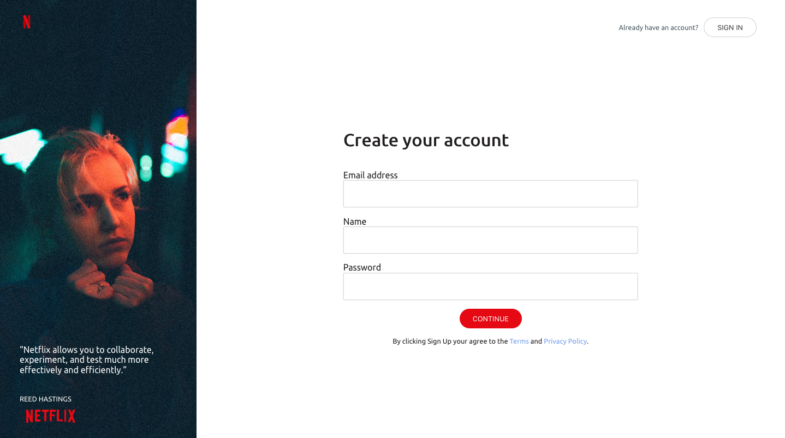

# Sign Up Template

Just a grid based sign up page.

Inspired by [InVision](https://projects.invisionapp.com/d/login).

## Assets

- [Ubuntu font](https://fonts.google.com/specimen/Ubuntu)
- [Girl photo](https://unsplash.com/photos/gEkL3UfB3qw)
- [Netflix brand assets](https://brand.netflix.com)

## License

This project is licensed under the MIT License - see the [LICENSE](LICENSE) file for details.
